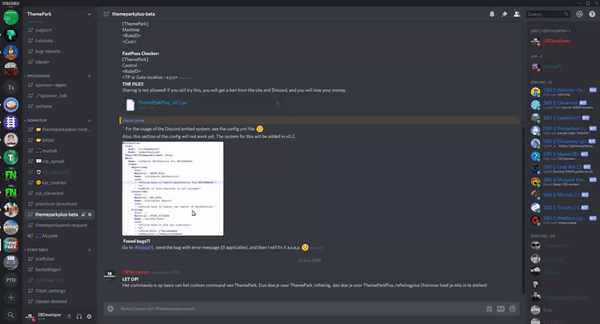

# FAQ

## ThemePark:

### How can I create an attraction?

That's very simple. You have to use the attraction.yml file for this:

1. Go to the **ThemePark** folder in the plugins folder, there yiy want to go into the **attractions** folder. In here choose the **&lt;region id&gt;.yml** for the region you want to add the attraction to.
2. Under **attractions:** you have to create a new attraction. Copy it from a attraction you've already made or from here. Pay attention that you get something like this \(with other names\):


```yaml
attractions:
  test:
    name: "&aTest"
    type: RIDE
    status: CLOSED
    location: "world:418:65:30"
  test2:
    name: "&aTest 2"
    type: RIDE
    status: CLOSED
    location: "world:418:65:30"
```


In this case, ****test is the **ID** of the **attraction**. **name** contians the name of the ride, **type** is **RIDE**. If you want to create a show, you have to put **SHOW** there. The **status** is **CLOSED** but you can use any status for this, you can also change it in-game. The **location** can also be changed in-game.

### How do you disable the item in specific worlds

To do this you have to use the settings.yml file and add the world to the worlds tab of the item. If I want to disable the world with the name "world\_name" I need to add it to the list of worlds like done bellow.

```yaml
item:
  #DEFAULT STUFF
  worlds:
  - world_name
```

## ThemeParkPlus:

### How can I setup the Discord Status system?

1. Go to the config.yml file of ThemeParkPlus
2. Set DiscordUpdates.Enabled on true
3. Create a webhook URL of Discord. See the GIF below.
4. Copy the URL of the webhook, and paste it into DiscordUpdates.WebhookURL
5. Now you can change the other settings if you want.
6. Done! Restart your server, and it will work. ;\)



### How can I give someone admin permissions in the panel?

1. Log in to your **database** with **PHPMyAdmin**. Then go to the **users** table.
2. Here you have to **find the user you want to give the admin right**, and then change the value of **userAdmin from 0 to 1**.

### What does "Disconnected from socket." mean?

The socket can't connect if:

* Your **MC name** does not match, or the **PIN** \[generated by the sign\] does not match.
* The MC server has **no socket connection**, the MC server has a **different ID** then the panel, or the ID is **used by multiple servers \(and thus taken\)**.
* The attraction is **not OPEN**/**CLOSED** AND **not ACTIVE**/**INACTIVE**.
* The attraction is **not** in the **panels.yml** **file**.

### How can I change the verification mail?

1. Create a file in app/Notifications called VerifyEmail.php and put the code below in it:


```php
<?php
namespace App\Notifications;
use Illuminate\Bus\Queueable;
use Illuminate\Notifications\Notification;
use Illuminate\Contracts\Queue\ShouldQueue;
use Illuminate\Notifications\Messages\MailMessage;
use Illuminate\Support\Carbon;
use Illuminate\Support\Facades\URL;
use Illuminate\Support\Facades\Lang;
use Illuminate\Auth\Notifications\VerifyEmail as VerifyEmailBase;

class VerifyEmail extends VerifyEmailBase
{
    public function toMail($notifiable)
    {
        if (static::$toMailCallback) {
            return call_user_func(static::$toMailCallback, $notifiable);
        }
		
		//Change content below
        return (new MailMessage)
            ->subject(Lang::getFromJson('Verify Email Address'))
            ->line(Lang::getFromJson('Please click the button below to verify your email address.'))
            ->action(
                Lang::getFromJson('Verify Email Address'),
                $this->verificationUrl($notifiable)
            )
            ->line(Lang::getFromJson('If you did not create an account, no further action is required.'));
    }
}
```


2. Open the User.php file in the app folder. Insert this below row 8:


```php
use App\Notifications\VerifyEmail;
```


And this at the bottom of that file:


```php
/**
 * Send the email verification notification.
 *
 * @return void
 */
public function sendEmailVerificationNotification()
{
    $this->notify(new VerifyEmail); // my notification
}
```


### How can I setup the OpenAudioMC integration?

1. Go to your server and type **/oa plus**. Then go to the API tab on that page. Copy the URL labeled **V1 - Get token** and paste it into the .env file at **OPENAUDIOMC\_URL**.
2. Change **&lt;PLAYER UUID&gt;** into **%UUID%** at the url in your .env file, or else it won't load the player UUID correctly.


## ActionFoto:

### Images aren't send to the panel. How to fix?

First check if you don't get any errors. **If not, make sure the name of the ActionFoto board is also the name of a ThemePark ride.** 

If you get an error, please check below.

#### I get the PacketTooBigException.

The error looks like this:

```bash
com.mysql.jdbc.PacketTooBigException: Packet for query is too large. You can change this value on the server by setting the max_allowed_packet' variable.
```

As you can see, you have to change the max\_allowed\_packet setting.

Open the my.cnf file and change **max\_allowed\_packet** from **32M** to **256M**. This will allow us to send bigger images.

