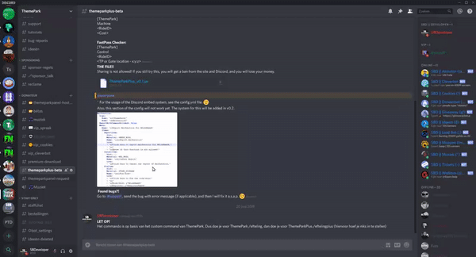

# FAQ

## ThemePark:

### How can I create an attraction?

That's very simple. You have to use the attraction.yml file for this:

1. Go to the **ThemePark** folder in the plugins folder, there yiy want to go into the **attractions** folder. In here choose the **\<region id>.yml** for the region you want to add the attraction to.
2. Under **attractions:** you have to create a new attraction. Copy it from a attraction you've already made or from here. Pay attention that you get something like this (with other names):


```yaml
attractions:
  test:
    name: "&aTest"
    type: RIDE
    status: CLOSED
    location: "world:418:65:30"
  test2:
    name: "&aTest 2"
    type: RIDE
    status: CLOSED
    location: "world:418:65:30"
```


In this case, **** test is the **ID** of the **attraction**. **name** contians the name of the ride, **type** is **RIDE**. If you want to create a show, you have to put **SHOW** there. The **status** is **CLOSED** but you can use any status for this, you can also change it in-game. The **location** can also be changed in-game.

### How do you disable the item in specific worlds

To do this you have to use the settings.yml file and add the world to the worlds tab of the item. If I want to disable the world with the name "world\_name" I need to add it to the list of worlds like done bellow.

```yaml
item:
  #DEFAULT STUFF
  worlds:
  - world_name
```

## ThemeParkPlus:

### How can I secure my panel using SSL?

1. Install certbot using `apt -y install certbot`
2. Make sure an A-record exists for your subdomain in your DNS records.
3. Make sure to stop your running webserver using `systemctl stop nginx`
4. Run `certbot certonly -d subdomain.yourpaneldomain.com` to install a certificate.
5. Done! Now you can use the SSL certificate. Make sure to start your webserver again using `systemctl start nginx`

### How can I setup the Discord Status system?

1. Go to the config.yml file of ThemeParkPlus
2. Set DiscordUpdates.Enabled on true
3. Create a webhook URL of Discord. See the GIF below.
4. Copy the URL of the webhook, and paste it into DiscordUpdates.WebhookURL
5. Now you can change the other settings if you want.
6. Done! Restart your server, and it will work. ;)



### How can I give someone admin permissions in the panel?

1. Log in to your **database** with **PHPMyAdmin**. Then go to the **users** table.
2. Here you have to **find the user you want to give the admin right**, and then change the value of **userAdmin from 0 to 1**.

### What does "Disconnected from socket." mean?

The socket can't connect if:

* Your **MC name** does not match, or the **PIN** \[generated by the sign] does not match.
* The MC server has **no socket connection**, the MC server has a **different ID** then the panel, or the ID is **used by multiple servers (and thus taken)**.
* The attraction is **not OPEN**/**CLOSED** AND **not ACTIVE**/**INACTIVE**.
* The attraction is **not** in the **panels.yml** **file**.

### How can I setup the OpenAudioMC integration?

1. Go to the [CraftMend Account panel](https://account.craftmend.com/). Create a new account or login to your account. Get a new fingerprint from [the fingerprint page](https://account.craftmend.com/account/fingerprint) and run the connect command (/oa fingerprint \<FingerPrint>) in your server. Then go to the [API page](https://account.craftmend.com/account/api). Copy the URL labeled **Online Players - V1** and paste it into the .env file at **OPENAUDIOMC\_URL**.
2. Change **{your api key}** into the API token you can get on the same page, and change **{server id}** into the Server ID of the server you want to connect (you can find that on the server page).

.png>)
